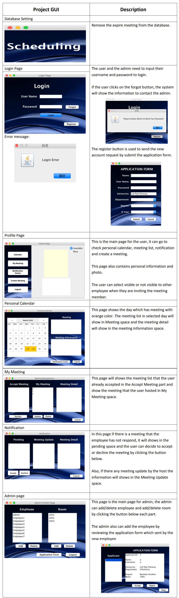

# Scheduling-Application
```
Using JAVA, Java Swing, Maven project and MongoDB
```
```
Import as Maven Project, Main file: src/main/java/cs580/App.java
```
```
NOTE: 
- User Name: UEmployee1, UEmployee2, UEmployee3, UEmployee4, UEmployee5, UEmployee6, UEmployee7, Admin
- Login Password: 0000
```
   The system that we are designing is to create a meeting scheduler, where employees can create meetings and invite other employees to them. The invited employee can choose to either accept, decline, or respond to the invitation at a later time. If the invited employee does not respond, the system will keep reminding the user to respond every time the user logins until the user accepts or declines the meeting invitation.



## License

This project is licensed under the MIT License - see the [LICENSE.md](LICENSE.md) file for details

## Project Team

* Team Member: Yueh-Lin Tsou (Hank)
* Team Member: Tho Nguyen (Todd)
* Team Member: Roger Halftermeyer (Roger)

* Contact (Hank): hank630280888@gmail.com
